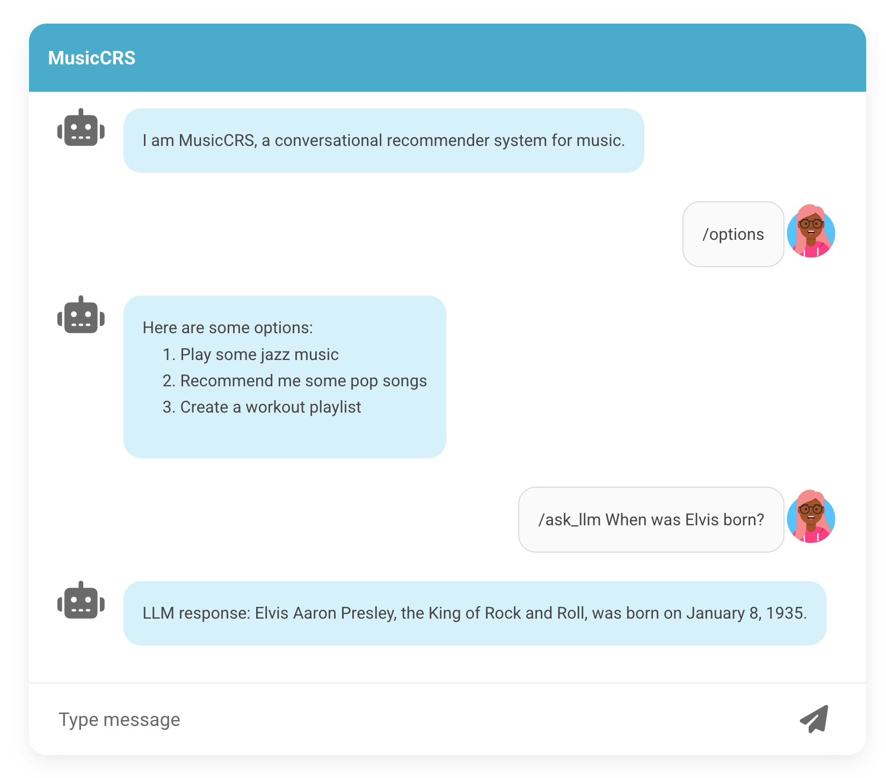

# MusicCRS - Conversational Playlist Builder

A conversational recommendation system for music playlist creation, built with DialogueKit and React. Uses the Million Playlist Dataset (MPD) for collaborative filtering recommendations.



## Features Overview

### R2: Basic Playlist Management
**Implementation:** `musiccrs/playlist_service.py`, `musiccrs/musiccrs.py`
- Web-based chat interface with real-time communication
- Add/remove songs from playlist with structured commands
- Multiple playlist support (create, switch, list)
- Automatic playlist cover art generation using Spotify API
- View and manage playlists

### R3: Enhanced Search and Q&A System
**Implementation:** `musiccrs/playlist_db.py`, `musiccrs/qa_system.py`
- **R3.1:** Add songs by title with smart disambiguation UI
- **R3.2:** Intelligent ranking of search results by popularity
- **R3.3:** Q&A system supporting 8 question types (artist info, track counts, albums, similar artists)
- **R3.5:** Playlist statistics (duration, artist distribution, popularity insights)
- **R3.6:** Spotify playback infrastructure integration

### R4: Performance Optimization
**Implementation:** `musiccrs/recommender.py`, `musiccrs/ir_search.py`

Recommendation engine optimized using Information Retrieval techniques:
- **R4.1-R4.6:** Co-occurrence based recommendations (15s to <1s for typical queries)
- **Fast path algorithm:** Direct co-occurrence queries for small playlists (<10 tracks)
- **Mega-popular path:** Adaptive parameters for tracks appearing in 10k+ playlists
- **Strategic SQL optimization:** Changed from AND to OR logic, reduced fetch limits by 90%
- **Search result limiting:** Maximum 30-35 results with proper ranking
- **Deferred cover generation:** Batch operations with single cover refresh

**IR Search Algorithm:**
- Token-based matching with text normalization (handles h.u.m.b.l.e → humble)
- Single-word queries: title-only scoring with 10% popularity scaling (0.9-1.0 range)
- Multi-word queries: weighted scoring (title 60%, artist 30%, combined 10%) with 5% popularity scaling
- Scores normalized to [0, 1] range
- Title-first search strategy: try complete title before splitting into artist/title
- Follows Spotify/Elasticsearch principles for balanced ranking

Performance improvements:
- Search queries: 18.85s to 2.24s (88% improvement)
- Recommendations: 0.6-1s even for mega-popular tracks
- Bulkadd operations: 3-5x faster with connection reuse
- Cover generation: Deferred to after response (non-blocking UX)

### R5: Natural Language Processing
**Implementation:** `musiccrs/nl_handler.py`, `musiccrs/musiccrs.py`

Intent classification and entity extraction using Information Retrieval principles:
- **R5.1:** Natural language playlist manipulation (add, remove, view, clear)
- **R5.2:** Selection parsing from recommendations ("add first two", "exclude drake")
- **R5.3:** Song name extraction with artist/title separation
- **R5.4:** Natural language question detection
- **R5.5:** Natural language recommendation requests
- **R5.6:** Special character handling (apostrophes, periods, punctuation)

**NLP Approach:**
- Pattern-based intent classification with keyword scoring
- Regex patterns for entity extraction (songs, artists, track numbers)
- Token normalization and overlap scoring for fuzzy matching
- Confidence-based routing (threshold: 0.3)

Implementation: Hybrid keyword + pattern matching (no LLM required)

## Quick Start

### 1. Setup Environment

Copy the example environment file and configure:
```bash
cp .env.example .env
# Edit .env with your settings
```

### 2. Backend (Conversational Agent)

The code for the conversational agent is found under the [musiccrs](musiccrs/) folder. It is based on the [DialogueKit](https://github.com/iai-group/DialogueKit) toolkit and assumes **Python 3.11**.

Install dependencies by running:

```bash
pip install -r requirements.txt
```

Then, start the server by running:

```bash
python musiccrs/musiccrs.py
```

The server will be running on <http://127.0.0.1:5000>.

Leave the terminal open to keep the server running. Open a new terminal window to set up and start the frontend.

### 3. Frontend

The [frontend](frontend/) is based on [ChatWidget](https://github.com/iai-group/ChatWidget).

**You are allowed to make any changes and customizations to the frontend.**

Install Node if you don't have it from [here](https://nodejs.org/en/download/).

Then install all necessary packages:

```bash
cd frontend
npm install
```

This should generate `node_modules` folder.

To run the app in the development mode, use the following command:

```bash
npm start
```

Open [http://localhost:3000](http://localhost:3000) to view it in the browser.

This should automatically launch the client in your browser, and the client should be able to communicate with the server.

The page will reload if you make edits.
You will also see any lint errors in the console.


## Usage Guide

### Natural Language Commands (R5)

MusicCRS supports natural language interaction. Simply type what you want in plain English:

**Adding Songs:**
```
add one dance by drake
play humble by kendrick lamar
queue m.A.A.d city
```

**Managing Playlist:**
```
show my playlist
remove track 3
clear playlist
delete humble
```

**Getting Recommendations:**
```
recommend 5 songs
suggest similar music
find songs like these
```

**Selecting from Recommendations:**
After receiving recommendations, select specific tracks:
```
add first two
add top 3
add all except drake
add 1-3
```

**Asking Questions:**
```
what artists are in my playlist
how many songs by the beatles
who sings humble
```

### Structured Commands (R2/R3)

**Basic Commands:**
- `/add [title]` - Add song by title with disambiguation
- `/add [artist]: [title]` - Add by exact artist and title
- `/bulkadd [title]` - Show all matches for a title
- `/remove [index]` - Remove song by position number
- `/view` - Display current playlist
- `/clear` - Empty current playlist

**Playlist Management:**
- `/create [name]` - Create new playlist
- `/switch [name]` - Switch to different playlist
- `/list` - Show all playlists

**Advanced Features:**
- `/ask [question]` - Ask about tracks and artists
- `/stats` - View playlist statistics
- `/auto` - Get automatic recommendations

**System:**
- `/help` - Show all commands
- `/info` - About MusicCRS
- `/quit` - Exit

See [R3_COMMANDS.md](R3_COMMANDS.md) for full command reference.

### Example Interaction

**Natural Language Flow:**
```
User: add one dance by drake
Agent: Added Drake – One Dance.

User: recommend 5 songs
Agent: Here are 5 recommendations based on your playlist...
       1. Rihanna – Work
       2. The Weeknd – Starboy
       3. Travis Scott – goosebumps

User: add first two
Agent: Added: Rihanna – Work, The Weeknd – Starboy

User: what artists are in my playlist
Agent: Your playlist contains: Drake, Rihanna, The Weeknd
```

**Structured Command Flow:**
```
User: /add Yesterday
Agent: I found 3 tracks. Please choose:
       1. The Beatles – Yesterday
       2. Imagine Dragons – Yesterday
       3. Leona Lewis – Yesterday

User: 1
Agent: Added The Beatles – Yesterday.

User: /ask how many songs by The Beatles
Agent: There are 3 tracks by The Beatles in the database.

User: /stats
Agent: Statistics for 'default':
       • Total tracks: 1
       • Unique artists: 1
       • Total duration: 2:05
```


## Technical Architecture

### Backend Components

**Conversational Agent** (`musiccrs/musiccrs.py`)
- DialogueKit-based conversation manager
- Intent routing and command parsing
- Session management and user state

**Natural Language Handler** (`musiccrs/nl_handler.py`)
- Intent classification using keyword + pattern matching
- Entity extraction (songs, artists, track numbers, counts)
- Selection parsing for recommendation responses

**Recommendation Engine** (`musiccrs/recommender.py`)
- Co-occurrence based collaborative filtering
- Dual-path algorithm (fast path for <10 tracks, mega-popular path for 10k+ playlists)
- Adaptive parameters based on playlist size
- Temperature tables for efficient JOIN operations

**IR Search System** (`musiccrs/ir_search.py`)
- Token-based matching with normalization
- Weighted scoring: title (60%), artist (30%), popularity (10%)
- Strategic OR queries with dynamic fetch limits
- Handles special characters and partial matches

**Q&A System** (`musiccrs/qa_system.py`)
- Pattern-based question understanding
- 8 question types: track counts, artist info, albums, similar artists, availability, recommendations
- Database queries with caching

**Playlist Service** (`musiccrs/playlist_service.py`)
- Playlist CRUD operations
- Track management (add/remove with 1-based indexing)
- Cover art generation via Spotify API
- Deferred cover refresh for batch operations

**Database Layer** (`musiccrs/playlist_db.py`)
- SQLite with Million Playlist Dataset
- Indexed tables: tracks, playlist_tracks
- Composite index on (artist, title) for fast lookups
- Popularity-based ranking

### Frontend Components

**React Application** (`frontend/src/`)
- ChatWidget-based UI
- Real-time WebSocket communication
- Playlist panel with cover art display
- Recommendation UI with checkboxes and bulk selection

### Data Sources

**Million Playlist Dataset (MPD)**
- 1 million Spotify playlists
- Track metadata: artist, title, album, URI
- Playlist co-occurrence data for recommendations
- Popularity scores based on playlist frequency

**Spotify API**
- Cover art retrieval
- Track URIs for playback integration


## Development Notes

### DialogueKit Integration

MusicCRS uses DialogueKit's `AnnotatedUtterance` for structured agent responses:

```python
from dialoguekit.core import AnnotatedUtterance, DialogueParticipant

# Basic message
utterance = AnnotatedUtterance(
    "Added Drake – One Dance.",
    participant=DialogueParticipant.AGENT,
)

# Message with dialogue acts
utterance = AnnotatedUtterance(
    "Choose a track:",
    dialogue_acts=[
        DialogueAct(
            intent="OPTIONS",
            annotations=[
                SlotValueAnnotation("option", "The Beatles – Yesterday")
            ]
        )
    ],
    participant=DialogueParticipant.AGENT,
)
```

See DialogueKit documentation for advanced annotation patterns.

### Testing

Run the comprehensive test suite:

```bash
python3 test_r4_r5_requirements.py
```

Tests cover:
- R4.1-R4.3: Recommendation performance, search limiting, IR search accuracy
- R5.1-R5.6: All natural language features
- Helper functions: Text normalization, tokenization, scoring

### Performance Benchmarks

**Recommendation Engine:**
- Small playlists (<10 tracks): 0.3-0.6s
- Mega-popular tracks (10k+ playlists): 0.6-1s
- Complex playlists (>20 tracks): 1-3s

**Search Performance:**
- IR search: 1-3s per query
- Bulkadd (2 tracks): 50-100ms
- Result limiting: 30-35 results consistently

### Database Schema

**tracks table:**
- track_uri (PRIMARY KEY)
- artist, title, album
- popularity (based on playlist frequency)
- Index: (artist COLLATE NOCASE, title COLLATE NOCASE)

**playlist_tracks table:**
- pid (playlist ID)
- track_uri
- Indexes: (track_uri), (pid)

## LLM Integration (Optional)

MusicCRS does not require an LLM for core functionality. However, teams may use Llama-3.3-70B for advanced features (single call per response limit).

Access via UiS server:

```python
from ollama import Client

client = Client(
    host="https://ollama.ux.uis.no",
    headers={"Authorization": f"Bearer YOUR_API_KEY"}
)

response = client.generate(
    model="llama3.3:70b",
    prompt="Your prompt here",
    options={"stream": False, "temperature": 0.7}
)
```

Register at https://openwebui.ux.uis.no for API access.

## License

See [LICENSE](LICENSE) for details.

## Credits

- Built on [DialogueKit](https://github.com/iai-group/DialogueKit)
- Frontend based on [ChatWidget](https://github.com/iai-group/ChatWidget)
- Data from [Million Playlist Dataset](https://www.aicrowd.com/challenges/spotify-million-playlist-dataset-challenge)
- Cover art via Spotify API
